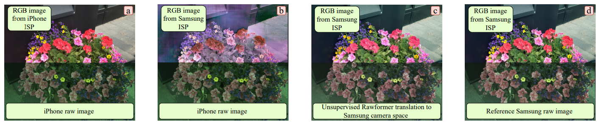

# Rawformer: Unpaired Raw-to-Raw Translation for Learnable Camera ISPs

🚀 The paper was accepted to the [ECCV 2024](https://eccv.ecva.net/Conferences/2024) conference. The preprint is available on [arXiv](https://arxiv.org/abs/2404.10700). 🚀

### Authors
Georgy Perevozchikov, Nancy Mehta, Mahmoud Afifi, Radu Timofte



### Abstract
*Modern smartphone camera quality heavily relies on the image signal processor (ISP) to enhance captured raw images, utilizing carefully designed modules to produce final output images encoded in a standard color space (e.g., sRGB). Neural-based end-to-end learnable ISPs offer promising advancements, potentially replacing traditional ISPs with their ability to adapt without requiring extensive tuning for each new camera model, as is often the case for nearly every module in traditional ISPs. However, the key challenge with the recent learning-based ISPs is the urge to collect large paired datasets for each distinct camera model due to the influence of intrinsic camera characteristics on the formation of input raw images. This paper tackles this challenge by introducing a novel method for unpaired learning of raw-to-raw translation across diverse cameras. Specifically, we propose Rawformer, an unsupervised Transformer-based encoder-decoder method for raw-to-raw translation. It accurately maps raw images captured by a certain camera to the target camera, facilitating the generalization of learnable ISPs to new unseen cameras. Our method demonstrates superior performance on real camera datasets, achieving higher accuracy compared to previous state-of-the-art techniques, and preserving a more robust correlation between the original and translated raw images.*

## To Do

*It is the first version of the code (0.1.0). We are working on the following tasks:*

- [x] Release Rawformer code
- [ ] Upload prepared datasets
- [ ] Upload the pre-trained models
- [ ] Rewrite the code to pytorch-lightning
- [ ] Add ONNX export scripts 


## Datasets

### Data Structure
```
- data
    - <dataset_name>
        - trainA
            - img1.jpg, img2.jpg, ...
        - trainB
            - imgA.jpg, imgB.jpg, ...
        - trainA
            - img1.jpg, img2.jpg, ...
        - trainB
            - imgA.jpg, imgB.jpg, ...
```

### Dowload Datasets

*Under construction*


## Pretained Models

*Under construction*


## How To Use

### Setup The Environment
```bash
git clone https://github.com/gosha20777/rawformer.git
cd rawformer
conda env create -n rawformer -f environment.yaml
conda activate rawformer
python setup.py install
```

### Train Rawformer

#### Pretrain Generator
```bash
cd experiments/<experiment_name>
python pretrain.py --batch-size 8
```

#### Train Rawformer
```bash
cd experiments/<experiment_name>
python train.py
```

#### Test Rawformer
```bash
cd experiments/<experiment_name>
python predict.py <model_path> --split test
```

## Citation
```BibTeX
@article{perevozchikov2024rawformer,
  title={Rawformer: Unpaired Raw-to-Raw Translation for Learnable Camera ISPs},
  author={Perevozchikov, Georgy and Mehta, Nancy and Afifi, Mahmoud and Timofte, Radu},
  journal={arXiv preprint arXiv:2404.10700},
  year={2024}
}
```
